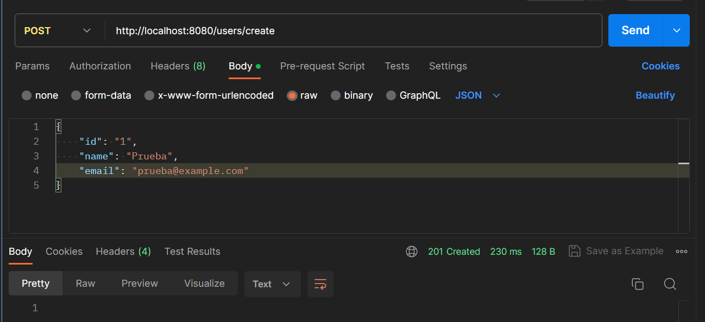
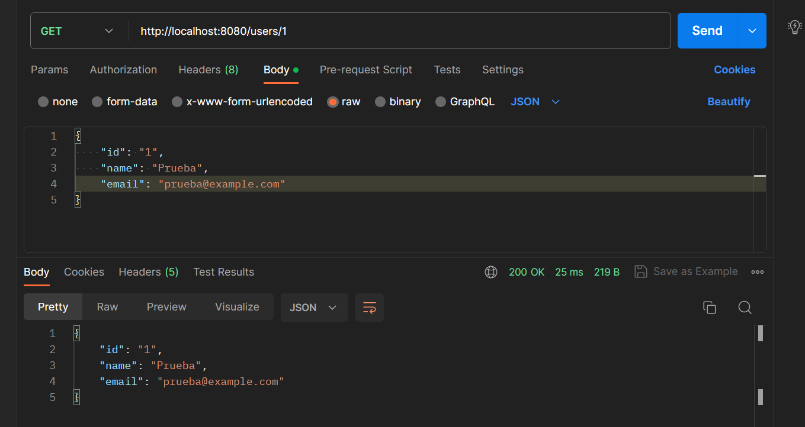

# PROYECTO INTEGRADOR

## NOMBRE APP: 

Es una aplicación diseñada para automatizar el procso de toma de lecturas de contadores de agua de agua de los clientes de un acueducto.

### Autores

* **Carol Cely**
* **Daniela García**
* **Santiago Bayona**
* **Juan Carlos Acosta**

### Prerequisitos
* Maven: Herramienta para la gestión y construcción de proyectos.
* Java: Lenguaje de programación.
* Git: Sistema de control de versiones distribuido.
* MongoDB: Base de datos NoSQL

**Prueba del funcionamiento de la base de datos**

